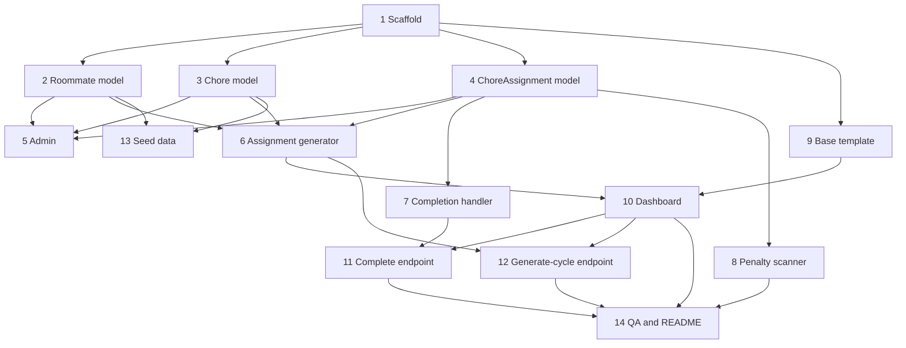

# Household Chore Manager — Task Backlog

Tasks are ordered by dependency and sized to fit a single work session. Each task is
self-contained: it names the files to touch and the section of the specification
([`_docs/plan.md`](_docs/plan.md)) it implements, so it can be handed to someone who has
not read the other tasks.

**Points rule (resolves a spec ambiguity):** Section 5.1's code comments say the
generator should only "temporarily increment or simulate" scores to balance the batch.
Therefore: the generator balances assignments using an in-memory copy of scores without
saving them; completing an assignment credits `chore.weight` to the roommate (spec §2.2);
penalizing an assignment deducts `chore.weight` (spec §5.3).

---

## 1. Scaffold an empty Django project with a passing test
Goal: A running, empty Django 5 project whose test suite passes.
Description: Setup and use python venv. Create a `requirements.txt` containing Django 5.x and install it. Run `django-admin startproject config .` and `python manage.py startapp chores`, then add `chores` to `INSTALLED_APPS` in `config/settings.py`. Add one trivial test in `chores/tests.py` (for example, asserting the test client gets a 404 from `/` for now), and verify both `python manage.py test` and `python manage.py runserver` succeed.

## 2. Add the Roommate model
Goal: A migrated `Roommate` model representing a household resident.
Description: In `chores/models.py` define `Roommate` with `name` (CharField, max_length=60), `total_points` (IntegerField, default=0), and `created_at` (DateTimeField, auto_now_add=True), plus a `__str__` returning the name (spec §4.1). Run `makemigrations` and `migrate`. Add tests in `chores/tests.py` covering field defaults and the string representation.

## 3. Add the Chore model
Goal: A migrated `Chore` model representing a recurring chore template.
Description: In `chores/models.py` define `Chore` with `title` (CharField, max_length=100), `description` (TextField, blank=True), `weight` (PositiveIntegerField, default=1), `recurrence_day` (IntegerField with DAYS_OF_WEEK choices, 0 = Monday to 6 = Sunday), and `is_active` (BooleanField, default=True) (spec §4.2). Run migrations. Add tests covering the defaults, the day choices, and `__str__`.

## 4. Add the ChoreAssignment model
Goal: A migrated `ChoreAssignment` model for scheduled chore occurrences.
Description: In `chores/models.py` define `ChoreAssignment` with ForeignKeys to `Chore` and `Roommate` (both `on_delete=CASCADE`), `due_date` (DateField), `status` (CharField with choices PENDING / COMPLETED / PENALIZED, default PENDING), and `completed_at` (DateTimeField, null=True, blank=True) (spec §4.3). Run migrations. Add tests covering the status default and the FK relationships.

## 5. Register models in the Django admin
Goal: Roommates, chores, and assignments are manageable at `/admin/`.
Description: Register `Roommate`, `Chore`, and `ChoreAssignment` in `chores/admin.py` with sensible `list_display` settings (e.g., name and total_points; title, weight, recurrence_day, is_active; chore, assigned_to, due_date, status). Create a superuser and confirm create/edit/delete works in the browser at `/admin/`. Add a test asserting all three models appear on the admin index page.

## 6. Implement the weekly assignment generator
Goal: `generate_weekly_assignments(target_week_start)` in `chores/services.py` distributes the week's chores fairly.
Description: Query active chores ordered by descending `weight`, compute each `due_date` as `target_week_start + recurrence_day` days, skip any (chore, due_date) pairs that already have an assignment, and assign each chore to the roommate with the lowest score, tie-breaking by primary key (spec §5.1). For intra-week balancing, keep scores in a batch-local dict seeded from `Roommate.total_points` and do not save them, per the points rule in the preamble. Cover with tests: heaviest chores assigned first, lowest-score roommate targeted, deterministic tie-breaks, duplicates skipped, inactive chores excluded, and correct Monday–Sunday due dates.

## 7. Implement the completion handler
Goal: A service function that marks a pending assignment COMPLETED and credits its points.
Description: Add `complete_assignment(assignment)` to `chores/services.py`: refuse if the status is not PENDING, set status to COMPLETED, stamp `completed_at` with `timezone.now()`, and add the chore's `weight` to `assigned_to.total_points` (spec §5.2 and §2.2). Cover with tests: a valid transition succeeds, a double completion is rejected, points are credited exactly once, and `completed_at` is set.

## 8. Implement the penalty scanner command
Goal: `python manage.py run_penalty_check` marks overdue assignments PENALIZED and deducts points.
Description: Add a management command at `chores/management/commands/run_penalty_check.py` that queries assignments with `due_date` before today and status PENDING, flips them to PENALIZED, and deducts the chore's `weight` from the roommate's `total_points` (spec §5.3). Cover with tests: overdue pending assignments are penalized and deducted, while future, completed, and already-penalized assignments are left untouched.

## 9. Build the base template with Pico.css
Goal: A shared `base.html` styled by Pico.css loaded from the CDN.
Description: Create `chores/templates/chores/base.html` that links `https://cdn.jsdelivr.net/npm/@picocss/pico@2/css/pico.min.css`, includes a `<nav>` with the app name and a link to `/admin/`, and defines a `<main class="container">` block for page content (spec §7). Verify with a test that renders a small child template extending it and asserts the CDN link and container element are present.

## 10. Build the dashboard view and template
Goal: `GET /` shows the leaderboard and this week's chore board.
Description: Add a dashboard view in `chores/views.py` wired to the root URL in `config/urls.py`, passing roommates ordered by `total_points` descending and the current week's assignments grouped by day (spec §6.1). Build `dashboard.html` extending the base template with `<article>` cards: a leaderboard table and per-day assignment listings showing title, weight badge, assignee, status, and an inline form POSTing to `/assignments/<id>/complete/` (spec §7). Cover with Django test-client tests asserting the leaderboard ordering and that each assignment renders its key fields.

## 11. Add the complete-chore endpoint
Goal: `POST /assignments/<id>/complete/` completes a chore and redirects home.
Description: Add a view and URL pattern that accepts a CSRF-protected POST, marks the assignment complete crediting its points (call `complete_assignment` from `chores/services.py`, implementing it inline per Task 7's description if it does not exist yet), and redirects to `/` (spec §6.2). Cover with tests: a POST completes a pending assignment and credits points once, the response redirects to `/`, and a GET or a repeated POST does not complete anything twice.

## 12. Add the generate-cycle trigger endpoint
Goal: A dashboard trigger at `/generate-cycle/` regenerates the week's assignments.
Description: Add a view and URL pattern for `/generate-cycle/` that calls `generate_weekly_assignments` with the current week's Monday and redirects to `/` (spec §6.3). Add a trigger button to the dashboard template, and test that hitting the endpoint creates the week's assignments and that a second call creates no duplicates before redirecting.

## 13. Add a seed data command
Goal: `python manage.py seed_data` loads demo roommates and chores.
Description: Create `chores/management/commands/seed_data.py` that creates three or four roommates and a handful of chores with varied weights (1–4) spread across different recurrence days, skipping records that already exist so it is safe to re-run (spec Step 5 mentions seeding). Add a test that running the command twice produces no duplicates, and use the command to walk through the app manually.

## 14. Run edge-case QA and write the README
Goal: All spec edge cases verified by tests and the README documents setup and usage.
Description: Working from seeded data, verify and cover with tests: point ties during generation, completing an already-penalized chore, penalty triggering on overdue chores, and duplicate generation attempts (spec Step 5). Finish by writing `README.md` with install, migrate, seed, runserver, and admin-access instructions.
